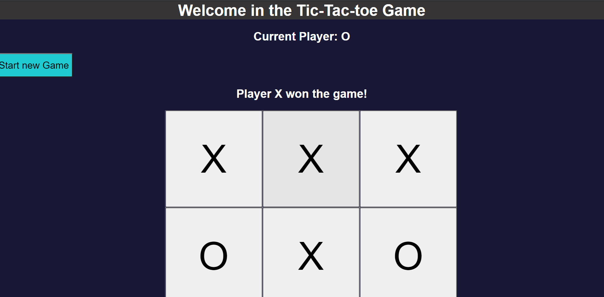
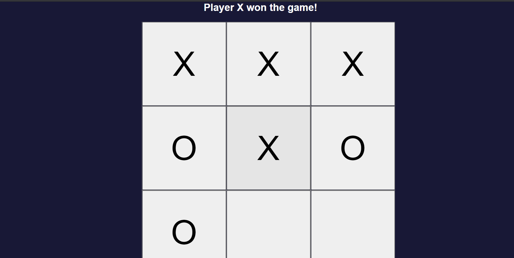
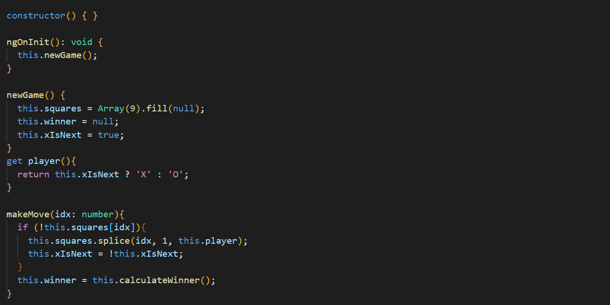
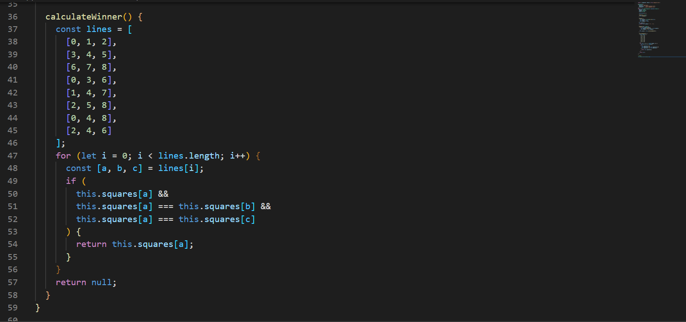

<h1>About</h1>
T his is a Tic-Tac-Toe Game Version generated with the powerful framework Angular. 
<h1>INSTALLATION</h1>
To install and run this project follow these steps:

Clone this repository

Install Angular cli Dependency

Run `ng serve` for a dev server. Navigate to `http://localhost:4200/

<h1>Example</h1>
#the Game page 

 the player X is the winner 

<h1>the code </h1>

<h2>-Make Movement</h2>

<h2>-Determine the winner</h2>

# TicTacToe

This project was generated with [Angular CLI](https://github.com/angular/angular-cli) version 11.2.6.

## Development server

Run `ng serve` for a dev server. Navigate to `http://localhost:4200/`. The app will automatically reload if you change any of the source files.

## Code scaffolding

Run `ng generate component component-name` to generate a new component. You can also use `ng generate directive|pipe|service|class|guard|interface|enum|module`.

## Build

Run `ng build` to build the project. The build artifacts will be stored in the `dist/` directory. Use the `--prod` flag for a production build.

## Running unit tests

Run `ng test` to execute the unit tests via [Karma](https://karma-runner.github.io).

## Running end-to-end tests

Run `ng e2e` to execute the end-to-end tests via [Protractor](http://www.protractortest.org/).

## Further help

To get more help on the Angular CLI use `ng help` or go check out the [Angular CLI Overview and Command Reference](https://angular.io/cli) page.
